# Deploy and Configure Zitadel Service Instance for Xpanse

This document will describe how to use docker to build a service instance of Zitadel, how to use
Terraform scripts to
initialize the configuration required for applications access to the service instance of Zitadel,
and how to configure the
applications xpanse and xpanse-ui to access the service instance of Zitadel. After completing all
these steps, we can
config the xpanse project with the service instance of Zitadel.

## Deploy Zitadel Service Instance

Here are two types of service instance deployment solutions. You can deploy a local service instance
of Zitadel according
to the document [local-installation-steps.md](local/local-installation-steps.md) or deploy a
production service instance of
Zitadel according to the
document [testbed-installation-steps.md](testlab/testbed-installation-steps.md).

When you can log in to the console of the deployed Zitadel service instance using the default
administrator user,
it means that the deployment is successful.

## Initialize the configuration for Applications.

When you can log in to the console of the deployed Zitadel service instance using the default
administrator user,
do the following steps to initialize the configuration for applications of Xpanse.

### Add Service User and Get Credential File

Before running Terraform Scripts to initialize the configuration, we need to add a service user as a
manager of the
instance, and download the credential file for the authentication which needed for running terraform
script.

1. Create a new service user.

The default administrator user login logged in successfully, click on `Users`,`Service User`,
and `+ New N` items on the console
in sequence to open page `Create a New User`.
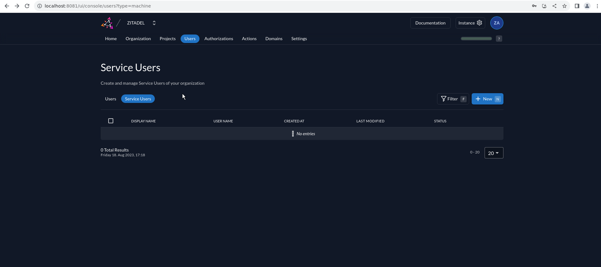
Fill in user information and select `JWT` as `Access Token Type`, then click the button `Create` to
create the new
service user.
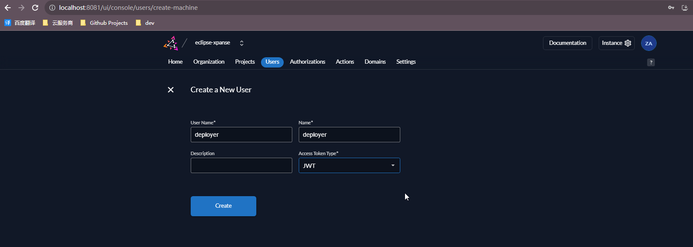

2. Get json file of the secret key added for the new service user.

After the service user is successfully created, click on the `Keys` label and then click on
the `Create` button to open
the pop-up window `Add Key`.

On the pop-up window `Add key`, select the item `JSON`  as `Type` and click on the `Add` button to
create the json file.
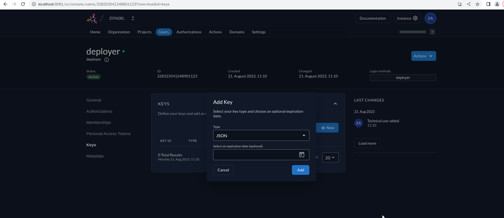
Then click on the `Download` button in the pop-up window to save the JSON file. After the file
download is completed,
click on the `Close` button to close the pop-up window.


3. Set the service user as a manager of the instance.

Click on the `Instance` button with the settings icon in the upper right corner of the page to
switch to the instance
management page.


Click on the `+` button to open the `Add a Manager` pop-up window, then click on the name of newly
created service user
as item under the `Loginname` and tick the `Iam Owner` as role. Finally, click on the `Add` button
to finish this step.


### Run Terraform Scripts to initialize the configuration

Enter the directory 'zitadel/terraform' under the project:

```shell
cd zitadel/terraform
 ```

#### Config SMTP to Enable User Registration

Add SMTP config to enable the function 'User Registration' of Zitadel service.
Fill all variables with suffix 'smtp_' in [terraform.tfvars](terraform/terraform.tfvars).

Read the document 'README.md' in the directory 'zitadel/terraform' and check preparation before
running terraform
scripts. What we need to pay attention to completing as below:

* Copy the json file we have already downloaded to the path and rename it to 'local-token.json'.
* Use the 'local.ftvars' to connect to the local service instance of Zitadel as below:

```shell
terraform init
terraform plan -var-file=environments/local.tfvars
terraform apply -auto-approve -var-file=environments/local.tfvars
```

After successfully executing the Terraform script, the Terraform outputs is as below:
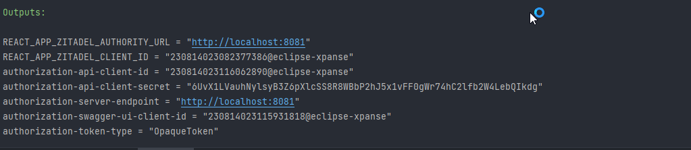

The default administrator user login the console of Zitadel to view added configurations:
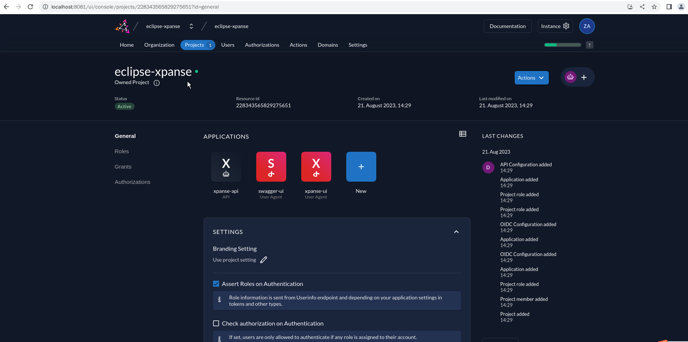

### Manual Configuration on Console

Due to an open bug in Zitadel-Terraform-Provider, we are not able to complete following settings and
must be done manually for now.

1. Set organization `XPANSE` as default.
   Open the organization management page, Click on the option 'Set as default organization' of the
   newly created organization named `XPANSE` in the list of `ORGANIZATIONS`,
   then click on the name `XPANSE` to open the manage page of organization `XPANSE`.
   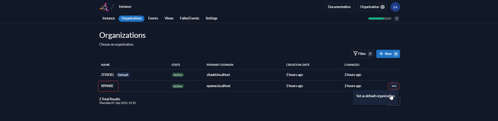
2. Set appearance of organization `XPANSE`.
   Click the button `Modify` in the box `Appearance` on the opened manage page of
   organization `XPANSE`.
   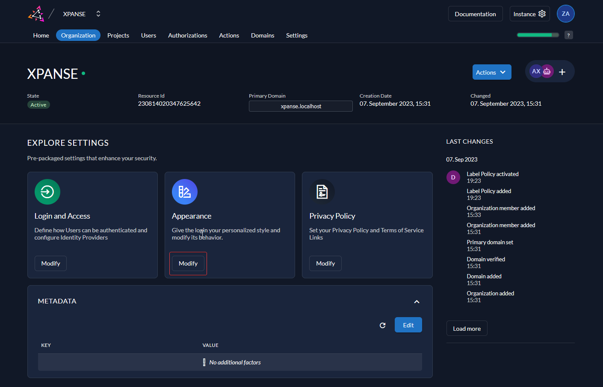
3. Upload logo and icon both in `Light Model` and `Dark Model`. The required logos and icons in the
   path[terraform/static/](terraform/static)
   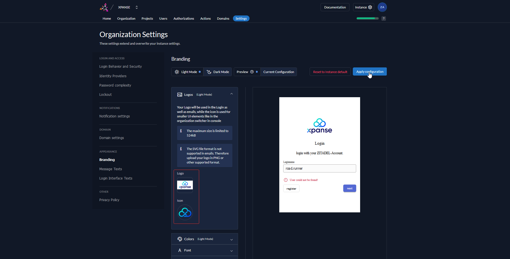

## Add Users for Xpanse

After completing the steps in [Manual Configuration on Console](#Manual Configuration on Console),
you can add users for xpanse in the following two ways:

### Add Admin User for Xpanse

To facilitate local development of the xpanse project, it is necessary to create an admin user with
all roles of 'xpanse'. Do following action to crate the admin user on the console:

#### Create New Admin User

1. Click on the menu `Users` and the `+ New` button on the console in sequence to open
   page `Create a New User` as below.
   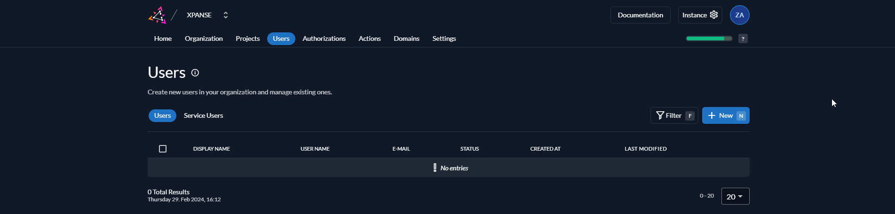
2. Fill all required fields and then click the button `Create` to create the new user.
   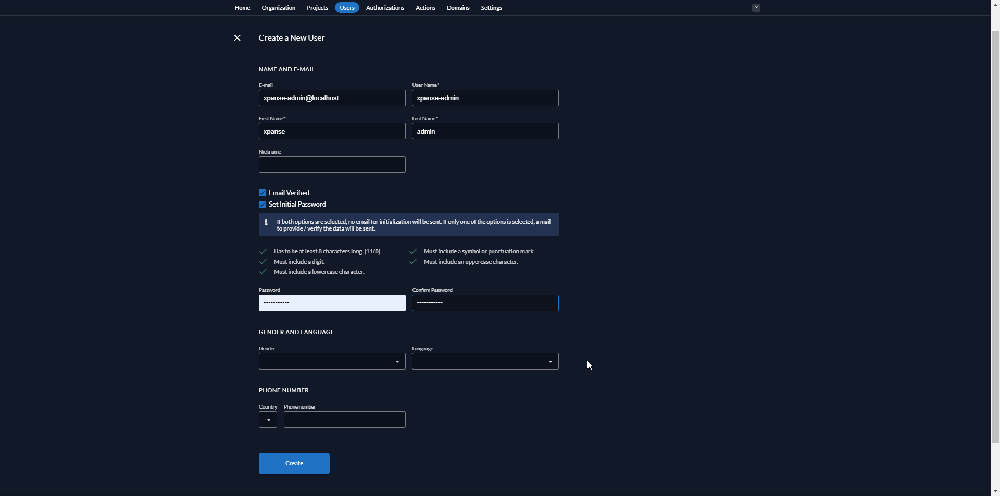

> Note: The user new created first login requires a password change, please remember the new
> password.
> If you want to create an end user without email, just select the role 'user' only or undo the
> following grant operation.

#### Grant Role To New Admin User

Follow the steps below to grant all roles of the project `eclipse-xpanse` to the new admin user:

1. Select item `Authorizations` under the user and then click on the button `+ New N` to start the
   grant;
   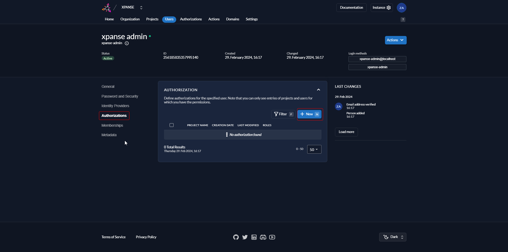
2. Select the project `eclipse-xpanse` and then click on the button `Continue`;
   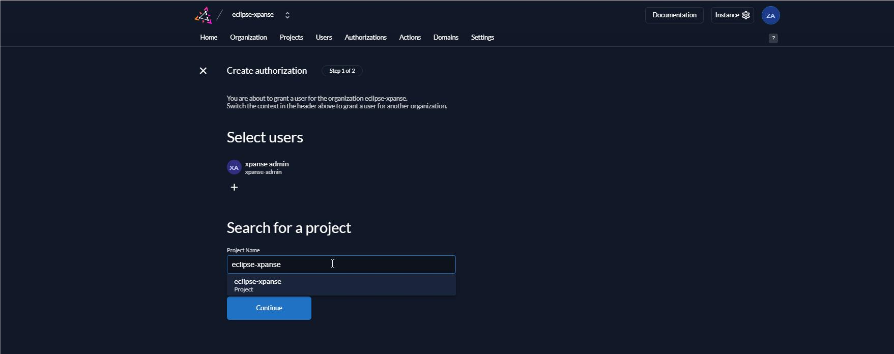
3. Select all roles to the grant and then clock on the button `Save`, Of course, you can also
   select the role `admin` only;
   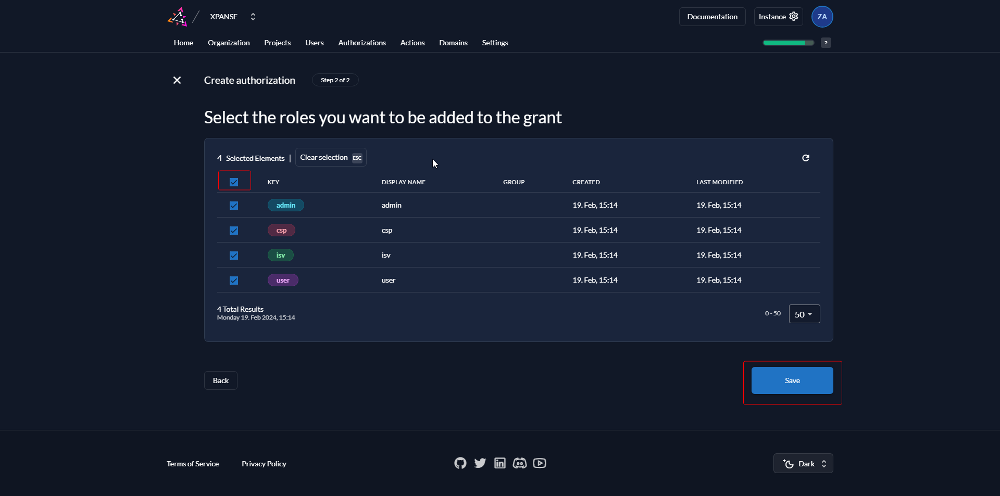
4. After completing the grant above, user has roles as below:
   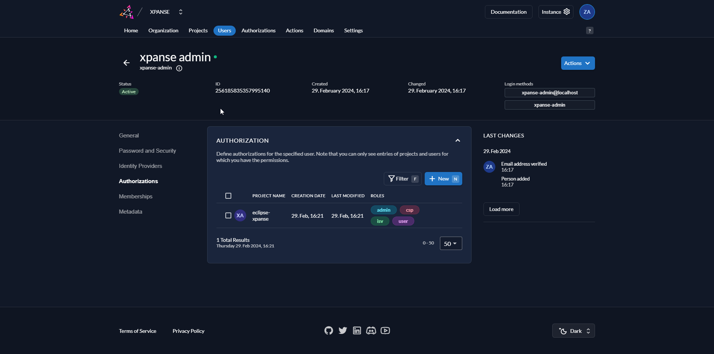

### Add Csp User for Xpanse

To facilitate local development of the xpanse project, it is necessary to create a csp user with
the role `csp` of 'xpanse'. Do following action to crate the csp user on the console:

#### Create New Csp User

1. Click on the menu `Users` and the `+ New` button on the console in sequence to open
   page `Create a New User` as below.
   
2. Fill all required fields and then click the button `Create` to create the new user.
   

#### Grant Role csp To New Csp User

Grant role `csp` of the project `eclipse-xpanse` to the new csp user.
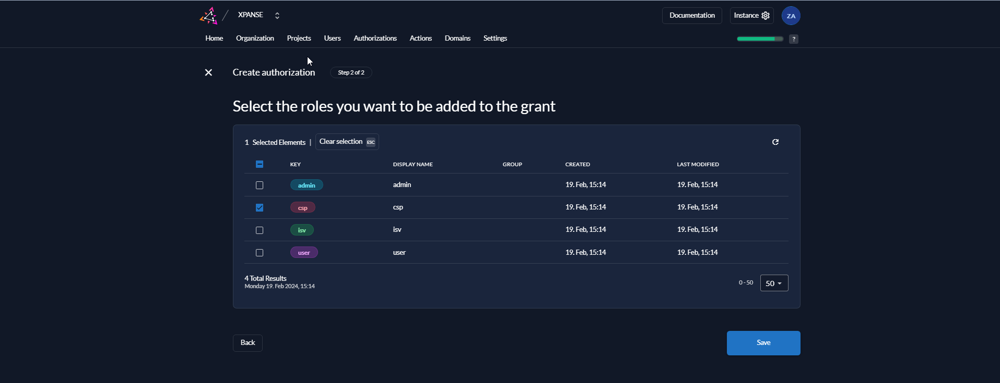

#### Edit Metadata Of New Csp User

Edit the metadata of the new csp user as below :

1. Select item `Metadata` under the csp user and then click on the button `Edit` to edit the
   metadata;
   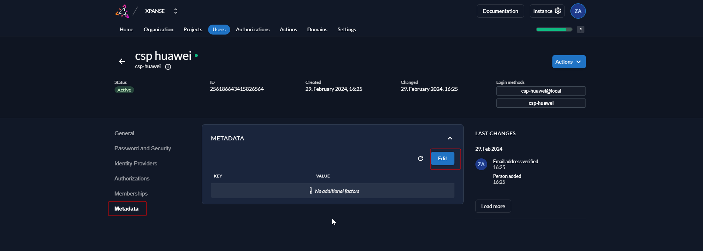
2. Fill the key `csp` with one value of enum `Csp` in xpanse and then click the icon `save`;
   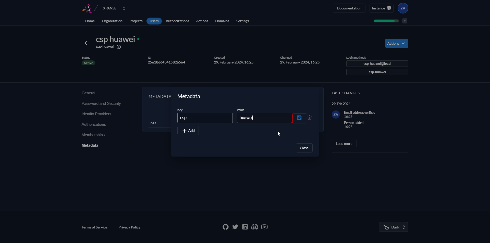
3. After completing the edit above, the csp user has metadata as below:
   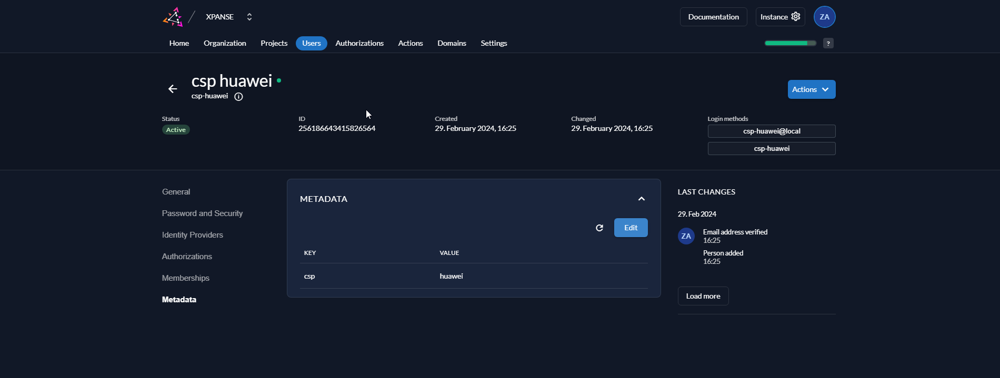

> Note: Add the key `csp` with a valid value into the metadata of the csp user is necessary.
> When the value of the key `csp` in the metadata is invalid or not exist, the csp user cannot
> view or manage any service template registered by the isv user in xpanse.

### Add Isv User for Xpanse

To facilitate local development of the xpanse project, it is necessary to create an isv user with
the role `isv` of 'xpanse'. Do following action to crate the isv user on the console:

#### Create New Isv User

1. Click on the menu `Users` and the `+ New` button on the console in sequence to open
   page `Create a New User` as below.
   
2. Fill all required fields and then click the button `Create` to create the new user.
   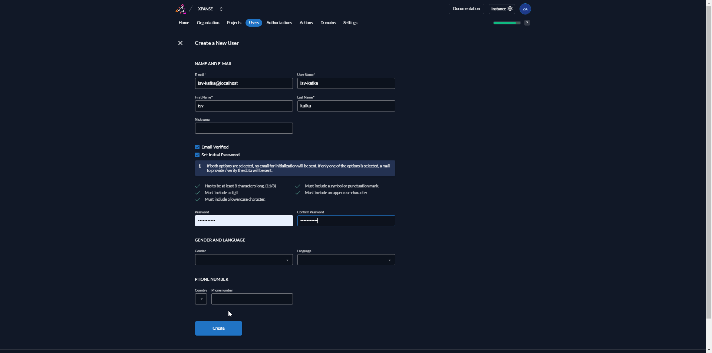

#### Grant Role To New Isv User

Grant role `isv` of the project `eclipse-xpanse` to the new isv user.
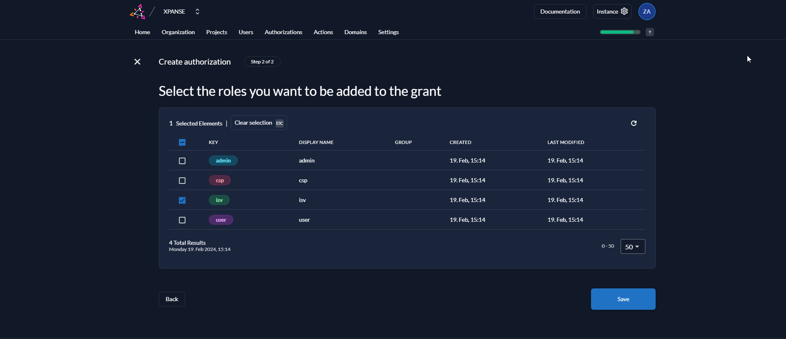

#### Edit Metadata Of New Isv User

Edit the metadata of the new isv user. Add key `isv` with fixed value into the metadata.
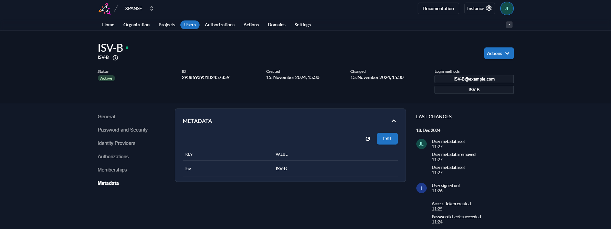

> Note: Add the key `isv` with a fixed value into the metadata of the isv user is necessary.
> The isv user can view or manage the registered service templates those owned the same value of
> `isv` in xpanse. If the value of the key `isv` in the metadata of isv user is
> invalid or not exist, the isv user only can view or manage the service templates registered
> by himself.

### Register End User for Xpanse

1. Click the button `register` on the login page of Zitadel console to open the page `Registration`.
   
2. Enter user data and then click button `next`.
   
3. Check the newly received email sent from the address of SMTP. If you received the email contains
   the code, copy the code to fill in the box and then click button `next`.
   

> Note: When no email is received within 1 minute, you can click the button `resend code`. After
> trying again a few times, if you haven't received the email yet, please check the
> configuration of SMTP as the following operation.

### Check SMTP Settings

1. Click `Setup SMTP` on the home page.
   
2. Check all filled value in item `SMTP Settings`. If all values are valid,
   click `Set SMTP Password` to reset password.
   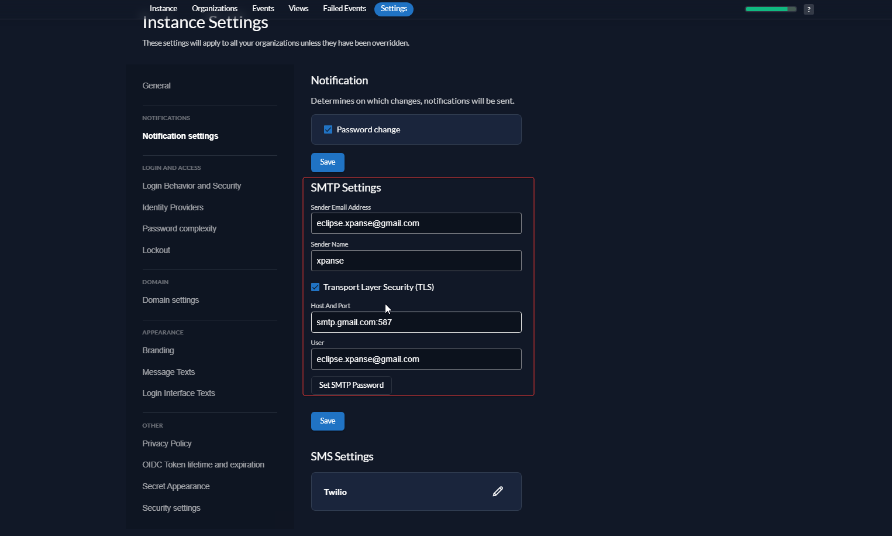
3. After checking all settings of SMTP are valid. Retry to register user again.

## Run Applications of Xpanse with service instance of Zitadel

### Configure and run the API service of Xpanse

Clone project [xpanse](https://github.com/eclipse-xpanse/xpanse.git) from remote to workspace in
local machine, then
enter the root path.

```shell
git clone https://github.com/eclipse-xpanse/xpanse.git
cd xpanse
```

Then compile the entire project using the below command:

```shell
mvn clean install -DskipTests=true
```

Start the application using the below command line. Fill the value for each variable with the value
of same item in the
Terraform Outputs.

```shell
java -jar runtime/target/xpanse-runtime-1.0.0-SNAPSHOT.jar \
--authorization-token-type=${authorization-token-type}
--authorization-api-client-id=${authorization-api-client-id} \
--authorization-api-client-secret=${authorization-api-client-secret} \
--authorization-swagger-ui-client-id=${authorization-api-swagger-ui-cleint-id}
```

> Note: Copy the value for each variable without quotes `"` from same item in the Terraform Outputs.

After the service is successfully started, open internet browser and navigate to URL of Swagger UI
http://localhost:8080/swagger-ui/index.html. Authorize on the page of Swagger UI as below:
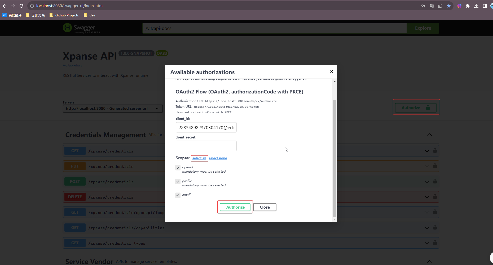
The browser will redirect to the login page of service instance of Zitadel with
URL http://localhost:8081/ui/login/login.
Use the created admin user to login and call all APIs on the Swagger UI after successful login.

### Configure and run the UI client of Xpanse.

Clone project [xpanse-ui](https://github.com/eclipse-xpanse/xpanse-ui.git) from remote to workspace
in local machine,
then enter the root path.

```shell
git clone https://github.com/eclipse-xpanse/xpanse-ui.git
cd xpanse-ui
```

Set `REACT_APP_ZITADEL_CLIENT_ID` environment variable with the value of same item in the Terraform
Outputs, then run
the below command to start UI client.

```shell
npm install
npm start
```

After the service is successfully started, open internet browser and navigate
to http://localhost:3000. The browser will
redirect to the login page of the service instance of Zitadel. Login with the created admin user of
xpanse.
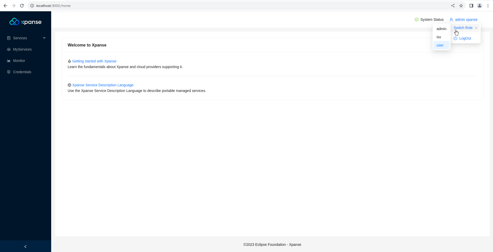

Now you can use the admin user to develop project 'xpanse' in local machine.
