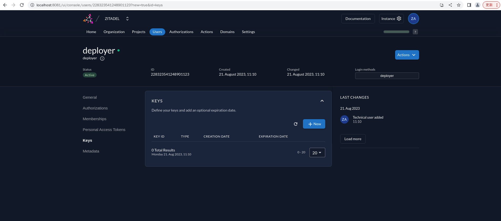
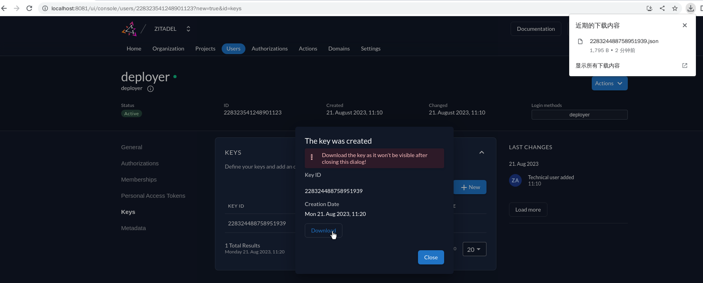
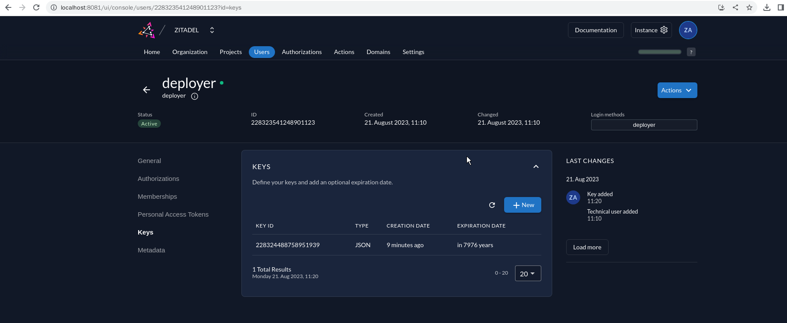
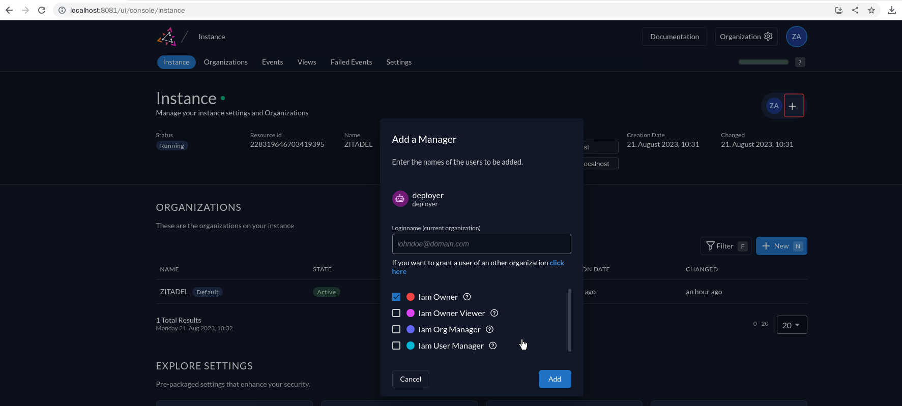
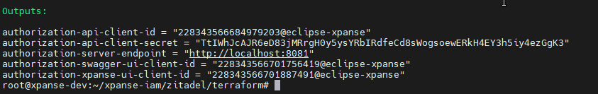
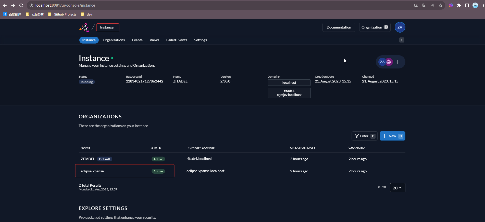
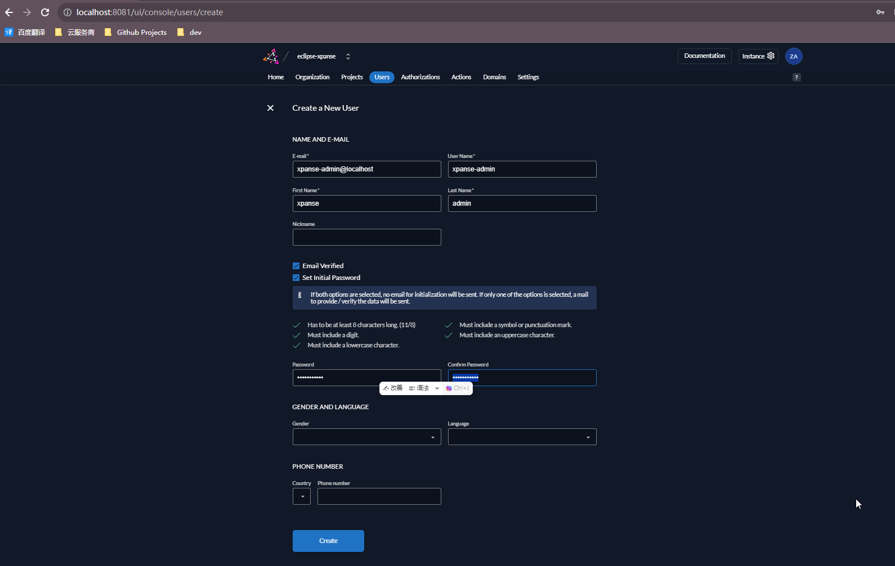
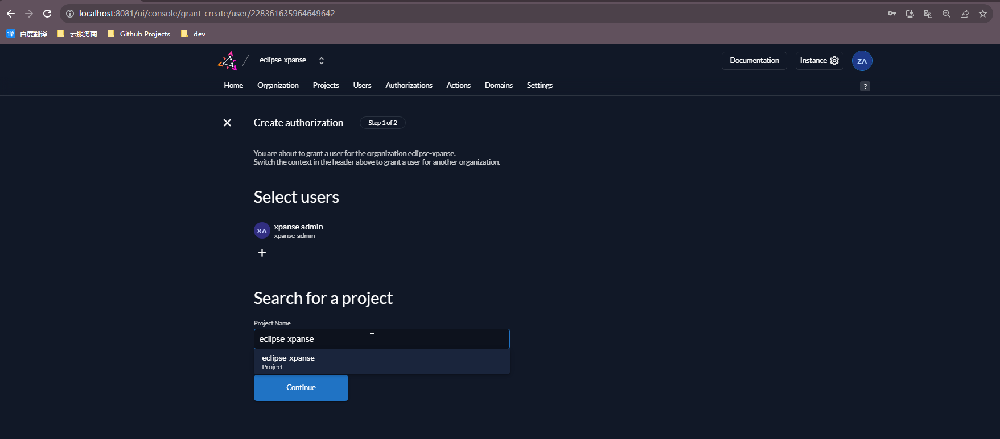

# Local Development Applications of Xpanse with Local Service of Zitadel

This document will describe how to use docker to build a local service of Zitadel, how to use Terraform scripts to
initialize the configuration required for applications access to the local service of Zitadel, and how to configure the
applications xpanse and xpanse-ui to access the local service of Zitadel. After completing all these steps, we can
develop the xpanse project with local service of Zitadel in the local machine.

Clone project [xpanse-iam](https://github.com/eclipse-xpanse/xpanse-iam.git) from remote to workspace in local machine.
Then enter the root path.

```shell
git clone https://github.com/eclipse-xpanse/xpanse-iam.git
cd xpanse-iam
 ```

## Deploy Local Service of Zitadel

Before deploying the local service of Zitadel, please install and start the Docker and Docker Compose service in the
local machine. Then start the local service of Zitadel using the below command:

```shell
docker-compose -f ./zitadel/local/compose/docker-compose-local.yaml up -d
 ```

> Note: This setup is tested against Docker version 20.10.17 and Docker Compose version v2.20.3.

The below display appears to indicate that the service has started normally.


Now you can open favorite internet browser and navigate to http://localhost:8081/ui/console. This is the default IAM
admin users login:

* username: zitadel-admin@zitadel.localhost
* password: Password1!

> Note: The first login requires a password change, please remember the new password.

## Run Terraform Scripts to initialize the configuration for Applications.

### Add Service User and Get Credential File.

Before running Terraform Scripts to initialize the configuration, we need to add a service user as a manager of the 
instance, and download the credential file for the authentication which needed for running terraform script.

1. Create a new service user.

The default IAM admin user login logged in successfully, click on `Users`,`Service User`, and `+ New N` items on the console
in sequence to open page `Create a New User`.

Fill in user information and select `JWT` as `Access Token Type`, then click the button `Create` to create the new 
service user.


2. Get json file of the secret key added for the new service user.

After the service user is successfully created, click on the `Keys` label and then click on the `Create` button to open
the pop-up window `Add Key`.

On the pop-up window `Add key`, select the item `JSON`  as `Type` and click on the `Add` button to create the json file.

Then click on the `Download` button in the pop-up window to save the JSON file. After the file download is completed,
click on the `Close` button to close the pop-up window.


3. Set the service user as a manager of the instance.

Click on the `Instance` button with the settings icon in the upper right corner of the page to switch to the instance
management page.


Click on the `+` button to open the `Add a Manager` pop-up window, then click on the name of newly created service user
as item under the `Loginname` and tick the `Iam Owner` as role. Finally, click on the `Add` button to finish this step.


### Run Terraform Scripts to initialize the configuration.

Enter the directory 'zitadel/terraform' under the project:

```shell
cd zitadel/terraform
 ```

Read the document 'README.md' in the directory 'zitadel/terraform' and check preparation before running terraform
scripts. What we need to pay attention to completing as below:

* Copy the json file we have already downloaded to the path and rename it to 'local-token.json'.
* Use the 'local.ftvars' to connect to the local service instance of Zitadel as below:

```shell
terraform init
terraform plan -var-file=environments/local.tfvars -var-file=environments/environment.tfvars
terraform apply -auto-approve -var-file=environments/local.tfvars -var-file=environments/environment.tfvars
```

After successfully executing the Terraform script, the Terraform outputs is as below:


The default IAM admin user login the console of Zitadel to view added configurations:


### Add Admin User of Xpanse

To facilitate local development of the xpanse project, it is necessary to create an admin user with all roles of
'xpanse'. Do following action to crate the admin user on the console:

Click on the name `eclipse-xpanse` in the list of `ORGANIZATIONS` to open the organization management page for the newly 
created organization named `eclipse-xpanse`.


Click on the menu `Users` and the `+ New` button on the console in sequence to open page `Create a New User` as below.
Fill all required fields and then click the button `Create` to create the new user.


> Note: The first login requires a password change, please remember the new password.

Follow the steps below to grant all roles of 'xpanse' for the new admin user:
1. Select item `Authorizations` under the user and then click on the button `+ New N` to start the grant;

2. Select the project `eclipse-xpanse`and then click on the button `Continue`;
   
3. Select all roles to the grant and then clock on the button `Save`;
   
   After completing the grant above, user has roles as below:
   

## Run Applications of Xpanse with Local Service of Zitadel

### Config and run the API service of Xpanse.

Clone project [xpanse](https://github.com/eclipse-xpanse/xpanse.git) from remote to workspace in local machine, then
enter the root path.

```shell
git clone https://github.com/eclipse-xpanse/xpanse.git
cd xpanse
```

Then compile the entire project using the below command:

```shell
mvn clean install -DskipTests=true
```

Start the application using the below command line. Fill the value for each variable with the value of same item in the
Terraform Outputs.

```shell
java -jar runtime/target/xpanse-runtime-1.0.0-SNAPSHOT.jar \
--authorization-api-client-id=${authorization-api-client-id} \
--authorization-api-client-secret=${authorization-api-client-secret} \
--authorization-swagger-ui-client-id=${authorization-api-swagger-ui-cleint-id}
```

> Note: Copy the value for each variable without quotes `"` from same item in the Terraform Outputs.

After the service is successfully started, open internet browser and navigate to URL of Swagger UI
http://localhost:8080/swagger-ui/index.html. Authorize on the page of Swagger UI as below:

The browser will redirect to the login page of local service of Zitadel with URL http://localhost:8081/ui/login/login.
Use the created admin user to login and call all APIs on the Swagger UI after successful login.

### Config and run the UI client of Xpanse.

Clone project [xpanse-ui](https://github.com/eclipse-xpanse/xpanse-ui.git) from remote to workspace in local machine,
then enter the root path.

```shell
git clone https://github.com/eclipse-xpanse/xpanse-ui.git
cd xpanse-ui
```

Set `REACT_APP_ZITADEL_CLIENT_ID` environment variable with the value of same item in the Terraform Outputs, then run 
the below command to start UI client.

```shell
npm install
npm start
```

After the service is successfully started, open internet browser and navigate to http://localhost:3000. The browser will
redirect to the login page of the local service of Zitadel. Login with the created xpanse admin user.


Now you can use the admin user to develop project 'xpanse' in local machine.


