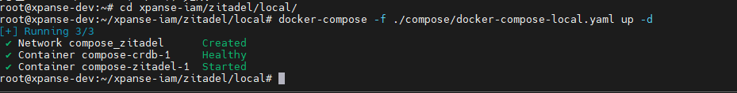

# Local Development Applications of Xpanse with Local Service of Zitadel

This document will describe how to use docker to build a local service of Zitadel.

Clone project [xpanse-iam](https://github.com/eclipse-xpanse/xpanse-iam.git) from remote to workspace in local machine.
Then enter the root path.

```shell
git clone https://github.com/eclipse-xpanse/xpanse-iam.git
cd xpanse-iam
 ```

## Deploy Local Service of Zitadel

Before deploying the local service of Zitadel, please install and start the Docker and Docker Compose service in the
local machine. Then start the local service of Zitadel using the below command:

```shell
docker-compose -f ./zitadel/local/compose/docker-compose-local.yaml up -d
 ```

> Note: This setup is tested against Docker version 20.10.17 and Docker Compose version v2.20.3.

The below display appears to indicate that the service has started normally.



Now you can open favorite internet browser and navigate to http://localhost:8081/ui/console. This is the default IAM
admin users login:

* username: zitadel-admin@zitadel.localhost
* password: Password1!

> Note: The first login requires a password change, please remember the new password.


